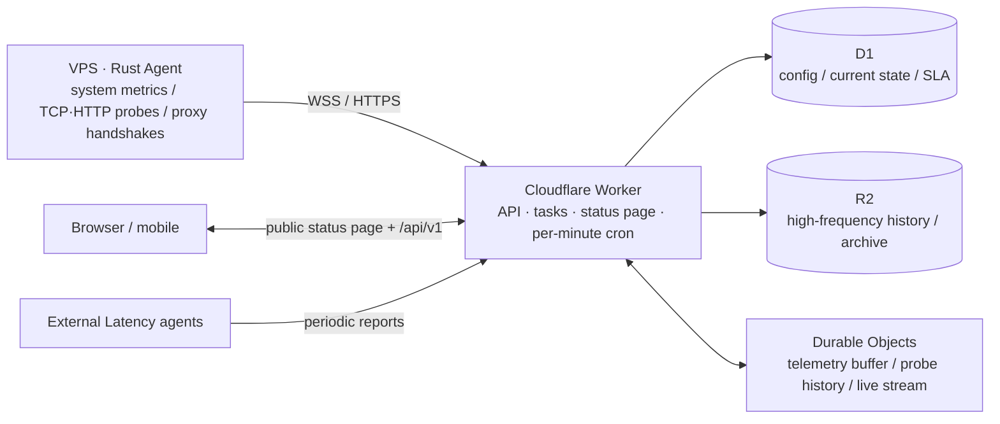

# NIE-SLA

NIE-SLA is a status page and VPS telemetry platform that runs on Cloudflare. The Worker handles public checks, the status page, and the control plane; a Rust agent on each VPS collects and reports system metrics. One version number covers the application, Worker, and Agent.

[](https://deploy.workers.cloudflare.com/?url=https://github.com/3257085208/NIE-SLA)

New deployments use a single Worker application for Static Assets, API, D1, R2, Durable Objects, and one-minute cron scheduling. A separate Pages project is not required.

## Architecture



## Deployment options

| Option | Best for | Entry point |
| --- | --- | --- |
| One-click (recommended) | Fast trial, personal self-hosting | **Deploy to Cloudflare** above |
| Command line | Custom domain, CI, or local preview | [Quick start](https://nie-sla.pages.dev/en/quickstart/) · Option B |

Both options deploy one Worker only: static frontend, admin panel, API, D1, R2, Durable Objects, and the per-minute cron ship together; no separate Pages project is required.

> Enable R2 in the Cloudflare dashboard before the one-click deploy (free tier: 10 GB storage, 1M Class A and 10M Class B operations per month; R2 still requires an R2 subscription with a payment method even for the free tier), otherwise the deploy stops at "uses R2, which is available with an R2 subscription". D1 and the R2 bucket are created and bound automatically.

> After deployment the `*.workers.dev` address returns `Not Found` by default. That is deliberate hardening: workers.dev is a parallel entry point that would bypass your custom-domain rate limits and protections. Without a domain yet, add the text variable `ALLOW_WORKERS_DEV` = `true` under the Worker's Settings → Variables and Secrets and redeploy; remove it after binding a custom domain. The public status page lives at `/` and the admin entry is the `ADMIN_PATH` you chose. See the [FAQ](https://nie-sla.pages.dev/en/faq/).

## Quick start

1. Click **Deploy to Cloudflare**.
2. Authorize GitHub and Cloudflare.
3. Set the admin username, password, path, and an independent long-term encryption key.
4. Open the deployed Worker and sign in.
5. Add a VPS and run its generated per-node Agent command.

Agent tokens are generated automatically. Keep `TOTP_ENCRYPTION_KEY` as an independent random value of at least 32 characters; changing the admin password must not change it. TOTP is disabled by default.

## Agent distribution

This repository is the only public distribution entry point self-hosters need. Cloudflare builds download the release pinned by `update-manifest.json`, verify `VERSION` and `SHA256SUMS`, and bundle the assets under the deployment's `/bin` path.

Installed Agents download install and update assets from their own deployed Worker/site. Individual VPS nodes never query the GitHub API; GitHub Releases distribute assets to deployments, and each deployment serves its own Agents.

## Capabilities

- Cloudflare HTTP/TCP availability and SLA history.
- Rust Agent CPU, memory, disk, load, IO, network, process, uptime, and temperature telemetry.
- Cloudflare latency, Agent TCP/HTTP probes, and external Latency Agents.
- Provider/custom provider, machine type, pricing, expiry, and independent traffic reset day.
- Agent-side IPv4/IPv6 GeoIP through selectable providers.
- Telegram and email alerts with templates.
- Portable and password-protected backup/restore.
- Versioned public read-only API for alternate frontends.
- Integrity-checked CSS themes and sandboxed full-layout Canvas themes.

## Fixed Beta actions

The admin panel can explicitly request NodeQuality or an IPv4 unlock check on Linux. The main Agent stays unprivileged; a separate root runner accepts only these two action identifiers. No arbitrary command, URL, arguments, stdin, or schedule can be supplied. Both entry scripts are reviewed source snapshots served by the deployment and verified by SHA-256; these diagnostics need raw sockets, route tracing, and system tools, so they run under the root-only Manager.

- NodeQuality options are chosen per task: HardwareQuality `y/f/v/n`, IPQuality `y/n`, NetQuality `y/l/n`, and Return Route `y/n`, default `f/y/y/y`. Current versions apply no external timeout.
- The Worker can render selected NodeQuality sections as SVG and upload them through a fixed channel with an empty folder. Image-host credentials stay in Worker Secrets; public reports use the same-origin image proxy instead of exposing the upstream host.
- The IPv4 unlock check runs `IP.Check.Place -4 -n -p`, saving a bounded full report (up to 64 KiB, ANSI colors included) plus the final media-unlock results; privacy mode does not upload the report to a third party.

## Public NQ dependency note

The NodeQuality script downloads its official scripts, components, BenchOs, and Geekbench 5 packages through a maintainer-run public mirror by default and falls back to official sources. Non-official deployments submit bounded `network`/`route` text to the maintainer's public image broker, without Agent tokens or image-host tokens; the official instance renders images on-site with its own S3 secrets. The actual public-chain addresses ship with the deployed code and do not depend on example domains in this README.

## Migration

Existing Pages + Worker installations should reuse their D1, R2, Agent API hostname, Target IDs, scoped credentials, and encryption material. Existing Agents then continue reporting without reconfiguration. Portable backup is a fallback; full high-frequency history remains in R2.

## Security

- Outbound-only Agents with per-node scoped tokens and single-use install tickets.
- Username/password sessions with optional OAuth allowlist and TOTP.
- Checksum-pinned Agent installation and updates.
- No Web Shell or arbitrary scheduled commands.
- Administrator-approved theme packages with no-same-origin Canvas isolation.
- No plugin, admin-script, marketplace, or arbitrary extension runtime.
- Encrypted sensitive backups and public payload redaction.
- Dedicated long-term encryption material for TOTP, recoverable Agent tokens, and admin-stored notification credentials.

## Validation

```bash
bash test.sh
```

## Theme development

The admin panel accepts SHA-256-verified CSS and Canvas theme ZIPs. See the [Third-Party Theme Specification](docs/en/13-third-party-themes.md) for the manifest, sandbox protocol, responsive requirements, and release checklist. Runnable sources are in `examples/themes/`.

## License

MIT
